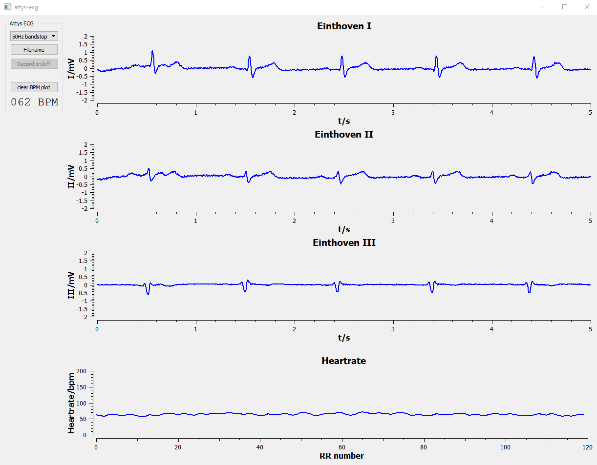
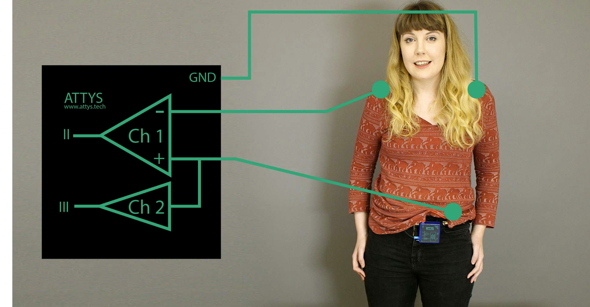
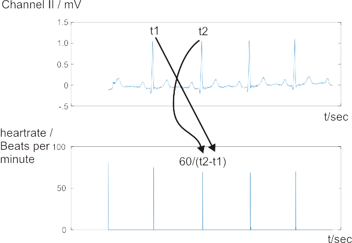

# attys-ecg

ECG app for [Attys](http://www.attys.tech)
for Windows/Linux

# Installation

## Linux / MacOS

You need the following libraries to compile and run the program:

- AttysComm (https://github.com/glasgowneuro/AttysComm)
- Qt5 / Qwt (standard UBUNTU packages)
- IIR filter library from https://github.com/berndporr/iir1
- FIR filter library from https://github.com/berndporr/fir1

Run "qmake", which generates a Makefile and "make" to compile
everything.

## Windows
* Install: Visual Studio 2017 community edition
* clone iir1 in your root directory: https://github.com/berndporr/iir1 and compile it (release and debug version)
* clone fir1 in your root directory: https://github.com/berndporr/fir1 and compile it (release and debug version)
* Download the open source version of QT5, 64 bits for visual C++ from www.qt.io.
* Download Qwt from http://qwt.sf.net (the latest version 6.x), unpack it in the parent directory and compile it (as release & debug)
* git clone https://github.com/glasgowneuro/AttysComm.git in the parent directory or modify the .pro file
* "qmake -tp vc" and then re-target the project twice (right click on attys_scope in the Solutions Explorer -> Retarget Projects)
* Edit attys-ecg.pro and adjust the path variables so that they point to AttysComm and the IIR libary
* Open the .sln file
* Build attys-ecg
* go to the "release" subdirectory
* copy qwt.dll into it
* run "windeployqt attys-ecg.exe qwt.dll" which copies all the DLLs into this directory which are needed to run the app
* Build the msi installer which will be in the "installer" subdirectory.

# Running attys-ecg

Just type: "./attys-ecg" or start it from the start menu under Windows.

# Electrode placement

# Heartrate detection
[https://github.com/glasgowneuro/attys-ecg/blob/master/ecg_rr_det.cpp]

The heartrate detector
measures the times between consecutive heartbeats and calculates the momentary
heartrate in beats per minute out of it:

# Credits

attys-ecg is based in part on the work of the Qwt project (http://qwt.sf.net).

